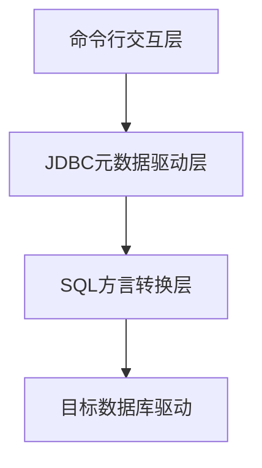

自从上次想支持 calcite benchmark 函数之后，通过 calcite 和 polardb-x 的一些调查，想直接支持是比较困难的，

所以现在我转入了 calcite，考虑看能否直接提交一些 pr 来慢慢熟悉calcite 这个项目。

# 查找可以提交的 jira

找了一段时间，也没找到啥方便支持的jira

ps: 发现了一个标签，可以找到新手方便参与的项目 jira
project = CALCITE AND resolution = Unresolved AND labels in (newbie,easy-fix) ORDER BY priority DESC, updated DESC

扫了一眼代码，发现 calcite 是可以支持 mongo 的，那么我探究看看，能够用 calcite 接入我本地的 mongo 项目，然后看看能否做一些提升。

现在就是两个方向。

1. 使用 mongo adapter 来运行起来

2. 查找新手任务

看了一圈新手任务，都是比较久远的了，而且看起来也不是那么容易实现。

所以我还是先搞 mongo adapter 了。

# 需求描述

1. 启动客户端，通过 mysql 命令行连接

2. 后端通过 calcite 将 mysql 命令转化为 mongo

3. 通过 calcite 连接 mongo

# 实现思路

参考 calcite 将 json 注册到 calcite 之后，通过 mysql 查数据的实现

https://calcite.apache.org/docs/

这篇文章告诉了我一些通过 calcite 查询 csv 的一些具体细节。以及规则应用和代价模型。

我还需要进一步了解这个 sqlline 是怎么自动连上这个的，代码是如何生效的，然后再仿写一个 mongo 的。

我先了解一下 sqlline 的大致原理和功能。

sqlline本质上是一个动态JDBC命令行客户端，其核心架构分为三层：


交互层：采用JLine库实现TAB补全、命令历史等交互功能

驱动层：通过反射动态加载JDBC驱动（关键代码片段）：

```java
Class.forName(driver).getDeclaredConstructor()
                   .newInstance().connect(url, props);
```
方言层：内置Hive/Phoenix等方言转换器，对Calcite使用ANSI SQL标准

使用事例
```
{
  "version": "1.0",
  "defaultSchema": "mongo",
  "schemas": [{
    "name": "mongo",
    "type": "custom",
    "factory": "org.apache.calcite.adapter.mongodb.MongoSchemaFactory",
    "operand": {
      "host": "localhost",
      "database": "test",
      "collection": "users"
    }
  }]
}
```

```bash
./sqlline -u "jdbc:calcite:model=src/main/resources/mongo-model.json" \
          -n admin -p admin \
          --driver=org.apache.calcite.jdbc.Driver
```

在 calcite /example/csv 下的 build.gradle.kts 中引入 mongodb 的依赖
```
dependencies {
    api(project(":core"))
    api(project(":file"))
    api(project(":linq4j"))
    // mongodb
    api(project(":mongodb"))
    api("org.checkerframework:checker-qual")
```
然后就可以连接上啦。

那么接下来我应该做些什么呢？

下载 sqlline 通过代码 debug 连接 mongodb 和 测试 相关 sql。