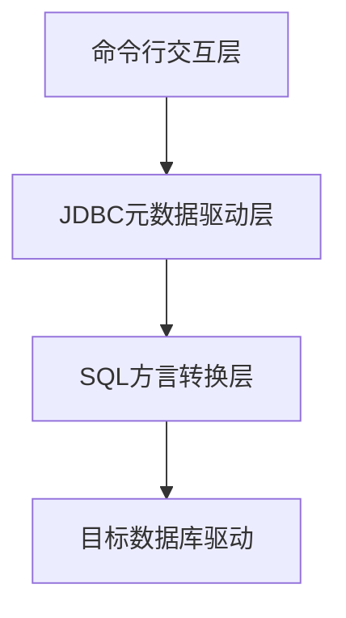

自从上次想支持 calcite benchmark 函数之后，通过 calcite 和 polardb-x 的一些调查，想直接支持是比较困难的，

所以现在我转入了 calcite，考虑看能否直接提交一些 pr 来慢慢熟悉calcite 这个项目。

# 查找可以提交的 jira

找了一段时间，也没找到啥方便支持的jira

ps: 发现了一个标签，可以找到新手方便参与的项目 jira
project = CALCITE AND resolution = Unresolved AND labels in (newbie,easy-fix) ORDER BY priority DESC, updated DESC

扫了一眼代码，发现 calcite 是可以支持 mongo 的，那么我探究看看，能够用 calcite 接入我本地的 mongo 项目，然后看看能否做一些提升。

现在就是两个方向。

1. 使用 mongo adapter 来运行起来

2. 查找新手任务

看了一圈新手任务，都是比较久远的了，而且看起来也不是那么容易实现。

所以我还是先搞 mongo adapter 了。

# 需求描述

1. 启动客户端，通过 mysql 命令行连接

2. 后端通过 calcite 将 mysql 命令转化为 mongo

3. 通过 calcite 连接 mongo

# 实现思路

参考 calcite 将 json 注册到 calcite 之后，通过 mysql 查数据的实现

https://calcite.apache.org/docs/

这篇文章告诉了我一些通过 calcite 查询 csv 的一些具体细节。以及规则应用和代价模型。

我还需要进一步了解这个 sqlline 是怎么自动连上这个的，代码是如何生效的，然后再仿写一个 mongo 的。

我先了解一下 sqlline 的大致原理和功能。

sqlline本质上是一个动态JDBC命令行客户端，其核心架构分为三层：


交互层：采用JLine库实现TAB补全、命令历史等交互功能

驱动层：通过反射动态加载JDBC驱动（关键代码片段）：

```java
Class.forName(driver).getDeclaredConstructor()
                   .newInstance().connect(url, props);
```
方言层：内置Hive/Phoenix等方言转换器，对Calcite使用ANSI SQL标准

使用事例
```
{
  "version": "1.0",
  "defaultSchema": "mongo",
  "schemas": [{
    "name": "mongo",
    "type": "custom",
    "factory": "org.apache.calcite.adapter.mongodb.MongoSchemaFactory",
    "operand": {
      "host": "localhost",
      "database": "test",
      "collection": "users"
    }
  }]
}
```

```bash
./sqlline -u "jdbc:calcite:model=src/main/resources/mongo-model.json" \
          -n admin -p admin \
          --driver=org.apache.calcite.jdbc.Driver
```

在 calcite /example/csv 下的 build.gradle.kts 中引入 mongodb 的依赖
```
dependencies {
    api(project(":core"))
    api(project(":file"))
    api(project(":linq4j"))
    // mongodb
    api(project(":mongodb"))
    api("org.checkerframework:checker-qual")
```
然后就可以连接上啦。

那么接下来我应该做些什么呢？

# 用 sqlline 源码调试 calcite mongodb 连接

下载 sqlline 通过代码 debug 连接 mongodb 和 测试 相关 sql。

在 pom 中增加依赖

```xml
    <dependency>
      <groupId>org.apache.calcite</groupId>
      <artifactId>calcite-core</artifactId>
      <version>1.39.0-SNAPSHOT</version>
    </dependency>
    <dependency>
      <groupId>org.apache.calcite</groupId>
      <artifactId>calcite-mongodb</artifactId>
      <version>1.39.0-SNAPSHOT</version>
    </dependency>
```

idea 上加上程序参数
```
Program arguments: -u "jdbc:calcite:model=path/to/mongo-model.json" -n ... 
```

运行 SqlLine 类

看起来展示有点儿问题。

```
0: jdbc:calcite:model=/Users/chenchuxin/Docum> !tables
+--+
|  |
+--+
|  |
|  |
|  |
```

找了网络信息，发现是 idea 的 debug 窗口 不支持 Jline，所以有这个问题。

https://github.com/julianhyde/sqlline/issues/80 在这里找到了解决方案

在program参数中添加这些后正常了

```
--maxWidth=120
--maxHeight=2000
--color=true
```

```
0: jdbc:calcite:model=/Users/chenchuxin/Docum> !tables
+-----------+-------------+-------------------------------+--------------+---------+----------+------------+-----------+
| TABLE_CAT | TABLE_SCHEM |          TABLE_NAME           |  TABLE_TYPE  | REMARKS | TYPE_CAT | TYPE_SCHEM | TYPE_NAME |
+-----------+-------------+-------------------------------+--------------+---------+----------+------------+-----------+
|           | metadata    | COLUMNS                       | SYSTEM TABLE |         |          |            |           |
|           | metadata    | TABLES                        | SYSTEM TABLE |         |          |            |           |
|           | mongo       | absEntityDict                 | TABLE        |         |          |            |           |
|           | mongo       | actionBindingTag              | TABLE        |         |          |            |           |
```

这下就可以愉快的测试了

试了下第一个 sql

```
0: jdbc:calcite:model=/Users/chenchuxin/Docum> select * from mechanism;
0: jdbc:calcite:model=/Users/chenchuxin/Docum> Error: Error while executing SQL "select * from mechanism": From line 1, column 15 to line 1, column 23: Object 'MECHANISM' not found within 'mongo'; did you mean 'mechanism'? (state=,code=0)
```

奇怪，咋 select * 都不行，是支持的不完善么。

试了下

```
select * from "mechanism";
```
发现也是报错，但是表是找到了，debug 发现应该是元数据字段读取的有问题。

经过一圈 debug 和查看源码的测试用例，发现mongodb 默认加了 _MAP 字段

因此可以按照如下方式查询，哈哈，可以成功啦。
```
0: jdbc:calcite:model=/Users/chenchuxin/Docum> select cast(_MAP['name'] AS varchar(20)) AS name from "mechanism";
+----------------------------------------------------------------------------------------------------------------------+
|                                                              NAME                                                    |
+----------------------------------------------------------------------------------------------------------------------+
| 专案机变更追踪机制                                                                                                            |
| 分阶段出图应因机制                                                                                                            |
| 旧料耗用机制                                                                                                               |
```

当然 deepseek 还给了其它方式，例如在配置中添加字段映射。

# 开始测试 sql，看支持度，然后考虑解决不支持的 sql

哈哈，直接在 MongoAdapterTest 中发现了一些被标注 disable 的 test 可以修复一下了

https://issues.apache.org/jira/browse/CALCITE-2115

```java
//  @Disabled("broken; [CALCITE-2115] is logged to fix it")
  @Test void testDistinctCount() {
    assertModel(MODEL)
        .query("select state, count(distinct city) as cdc from zips\n"
            + "where state in ('CA', 'TX') group by state order by state")
        .returns("STATE=CA; CDC=3\n"
            + "STATE=TX; CDC=3\n")
        .queryContains(
            mongoChecker(
                "{\n"
                    + "  \"$match\": {\n"
                    + "    \"$or\": [\n"
                    + "      {\n"
                    + "        \"state\": \"CA\"\n"
                    + "      },\n"
                    + "      {\n"
                    + "        \"state\": \"TX\"\n"
                    + "      }\n"
                    + "    ]\n"
                    + "  }\n"
                    + "}",
                "{$project: {CITY: '$city', STATE: '$state'}}",
                "{$group: {_id: {CITY: '$CITY', STATE: '$STATE'}}}",
                "{$project: {_id: 0, CITY: '$_id.CITY', STATE: '$_id.STATE'}}",
                "{$group: {_id: '$STATE', CDC: {$sum: {$cond: [ {$eq: ['CITY', null]}, 0, 1]}}}}",
                "{$project: {STATE: '$_id', CDC: '$CDC'}}",
                "{$sort: {STATE: 1}}"));
  }
```

代码里找到了这个 待修复的测试用例

https://issues.apache.org/jira/browse/CALCITE-2115

### docker 搭建本地mongodb 环境
```
docker pull mongo

docker run --name mongodb -e MONGO_INITDB_ROOT_USERNAME=mongoadmin -e MONGO_INITDB_ROOT_PASSWORD=secret -p 27017:27017 -d mongo:latest

docker run -it --rm mongo mongosh --host host.docker.internal -u mongoadmin -p secret --authenticationDatabase admin some-db

use test

db.zips.insertMany([
  { "_id" : "01701", "city" : "FRAMINGHAM", "loc" : [ -71.42548600000001, 42.300665 ], "pop" : 65046, "state" : "MA" },
{ "_id" : "02154", "city" : "NORTH WALTHAM", "loc" : [ -71.236497, 42.382492 ], "pop" : 57871, "state" : "MA" },
{ "_id" : "02401", "city" : "BROCKTON", "loc" : [ -71.03434799999999, 42.081571 ], "pop" : 59498, "state" : "MA" },
{ "_id" : "02840", "city" : "MIDDLETOWN", "loc" : [ -71.30347999999999, 41.504502 ], "pop" : 47687, "state" : "RI" },
{ "_id" : "02860", "city" : "PAWTUCKET", "loc" : [ -71.39071300000001, 41.872873 ], "pop" : 45442, "state" : "RI" },
{ "_id" : "02895", "city" : "NORTH SMITHFIELD", "loc" : [ -71.513683, 41.99948 ], "pop" : 53733, "state" : "RI" },
{ "_id" : "03060", "city" : "NASHUA", "loc" : [ -71.466684, 42.756395 ], "pop" : 41438, "state" : "NH" },
{ "_id" : "03103", "city" : "MANCHESTER", "loc" : [ -71.449325, 42.965563 ], "pop" : 36613, "state" : "NH" },
{ "_id" : "03301", "city" : "CONCORD", "loc" : [ -71.527734, 43.218525 ], "pop" : 34035, "state" : "NH" },
{ "_id" : "04240", "city" : "LEWISTON", "loc" : [ -70.191619, 44.098538 ], "pop" : 40173, "state" : "ME" },
{ "_id" : "04401", "city" : "BANGOR", "loc" : [ -68.791839, 44.824199 ], "pop" : 40434, "state" : "ME" },
{ "_id" : "05301", "city" : "BRATTLEBORO", "loc" : [ -72.593322, 42.857353 ], "pop" : 17522, "state" : "VT" },
{ "_id" : "05401", "city" : "BURLINGTON", "loc" : [ -73.219875, 44.484023 ], "pop" : 39127, "state" : "VT" },
{ "_id" : "05701", "city" : "RUTLAND", "loc" : [ -72.97077299999999, 43.614131 ], "pop" : 22576, "state" : "VT" },
{ "_id" : "06010", "city" : "BRISTOL", "loc" : [ -72.930193, 41.682293 ], "pop" : 60670, "state" : "CT" },
{ "_id" : "06450", "city" : "MERIDEN", "loc" : [ -72.799734, 41.533396 ], "pop" : 59441, "state" : "CT" },
{ "_id" : "06902", "city" : "STAMFORD", "loc" : [ -73.53742800000001, 41.052552 ], "pop" : 54605, "state" : "CT" },
{ "_id" : "07002", "city" : "BAYONNE", "loc" : [ -74.119169, 40.666399 ], "pop" : 61444, "state" : "NJ" },
{ "_id" : "07087", "city" : "WEEHAWKEN", "loc" : [ -74.030558, 40.768153 ], "pop" : 69646, "state" : "NJ" },
{ "_id" : "07111", "city" : "IRVINGTON", "loc" : [ -74.23127100000001, 40.7261 ], "pop" : 60986, "state" : "NJ" },
{ "_id" : "10021", "city" : "NEW YORK", "loc" : [ -73.958805, 40.768476 ], "pop" : 106564, "state" : "NY" },
{ "_id" : "11226", "city" : "BROOKLYN", "loc" : [ -73.956985, 40.646694 ], "pop" : 111396, "state" : "NY" },
{ "_id" : "11373", "city" : "JACKSON HEIGHTS", "loc" : [ -73.878551, 40.740388 ], "pop" : 88241, "state" : "NY" },
{ "_id" : "17042", "city" : "CLEONA", "loc" : [ -76.425895, 40.335912 ], "pop" : 61993, "state" : "PA" },
{ "_id" : "18042", "city" : "FORKS TOWNSHIP", "loc" : [ -75.23582, 40.6867 ], "pop" : 65784, "state" : "PA" },
{ "_id" : "19143", "city" : "PHILADELPHIA", "loc" : [ -75.228819, 39.944815 ], "pop" : 80454, "state" : "PA" },
{ "_id" : "19711", "city" : "NEWARK", "loc" : [ -75.737534, 39.701129 ], "pop" : 50573, "state" : "DE" },
{ "_id" : "19720", "city" : "MANOR", "loc" : [ -75.589938, 39.67703 ], "pop" : 46906, "state" : "DE" },
{ "_id" : "19901", "city" : "DOVER", "loc" : [ -75.535983, 39.156639 ], "pop" : 46005, "state" : "DE" },
{ "_id" : "20011", "city" : "WASHINGTON", "loc" : [ -77.020251, 38.951786 ], "pop" : 62924, "state" : "DC" },
{ "_id" : "20301", "city" : "PENTAGON", "loc" : [ -77.038196, 38.891019 ], "pop" : 21, "state" : "DC" },
{ "_id" : "21061", "city" : "GLEN BURNIE", "loc" : [ -76.61886199999999, 39.158968 ], "pop" : 75692, "state" : "MD" },
{ "_id" : "21207", "city" : "GWYNN OAK", "loc" : [ -76.734064, 39.329628 ], "pop" : 76002, "state" : "MD" },
{ "_id" : "21215", "city" : "BALTIMORE", "loc" : [ -76.67939699999999, 39.344572 ], "pop" : 74402, "state" : "MD" },
{ "_id" : "22901", "city" : "CHARLOTTESVILLE", "loc" : [ -78.490869, 38.054752 ], "pop" : 62708, "state" : "VA" },
{ "_id" : "23464", "city" : "VIRGINIA BEACH", "loc" : [ -76.175909, 36.797772 ], "pop" : 67276, "state" : "VA" },
{ "_id" : "23602", "city" : "NEWPORT NEWS", "loc" : [ -76.53212499999999, 37.131684 ], "pop" : 68525, "state" : "VA" },
{ "_id" : "25801", "city" : "BECKLEY", "loc" : [ -81.206084, 37.793214 ], "pop" : 45196, "state" : "WV" },
{ "_id" : "26003", "city" : "ELM GROVE", "loc" : [ -80.685126, 40.072736 ], "pop" : 49136, "state" : "WV" },
{ "_id" : "26505", "city" : "STAR CITY", "loc" : [ -79.95422499999999, 39.633858 ], "pop" : 70185, "state" : "WV" },
{ "_id" : "27292", "city" : "LEXINGTON", "loc" : [ -80.262049, 35.82306 ], "pop" : 69179, "state" : "NC" },
{ "_id" : "28677", "city" : "STATESVILLE", "loc" : [ -80.894009, 35.799022 ], "pop" : 52895, "state" : "NC" },
{ "_id" : "29150", "city" : "OSWEGO", "loc" : [ -80.32100800000001, 33.928199 ], "pop" : 46394, "state" : "SC" },
{ "_id" : "29501", "city" : "FLORENCE", "loc" : [ -79.772786, 34.18375 ], "pop" : 66990, "state" : "SC" },
{ "_id" : "29801", "city" : "AIKEN", "loc" : [ -81.71942900000001, 33.553024 ], "pop" : 51233, "state" : "SC" },
{ "_id" : "30032", "city" : "DECATUR", "loc" : [ -84.263165, 33.740825 ], "pop" : 56056, "state" : "GA" },
{ "_id" : "30906", "city" : "PEACH ORCHARD", "loc" : [ -82.038358, 33.402024 ], "pop" : 58646, "state" : "GA" },
{ "_id" : "32216", "city" : "JACKSONVILLE", "loc" : [ -81.547387, 30.293907 ], "pop" : 58867, "state" : "FL" },
{ "_id" : "33012", "city" : "HIALEAH", "loc" : [ -80.30589999999999, 25.865395 ], "pop" : 73194, "state" : "FL" },
{ "_id" : "33311", "city" : "FORT LAUDERDALE", "loc" : [ -80.172786, 26.142104 ], "pop" : 65378, "state" : "FL" },
{ "_id" : "35215", "city" : "CENTER POINT", "loc" : [ -86.693197, 33.635447 ], "pop" : 43862, "state" : "AL" },
{ "_id" : "35401", "city" : "TUSCALOOSA", "loc" : [ -87.56266599999999, 33.196891 ], "pop" : 42124, "state" : "AL" },
{ "_id" : "35901", "city" : "SOUTHSIDE", "loc" : [ -86.010279, 33.997248 ], "pop" : 44165, "state" : "AL" },
{ "_id" : "37042", "city" : "CLARKSVILLE", "loc" : [ -87.418621, 36.585315 ], "pop" : 43296, "state" : "TN" },
{ "_id" : "37211", "city" : "NASHVILLE", "loc" : [ -86.72403799999999, 36.072486 ], "pop" : 51478, "state" : "TN" },
{ "_id" : "38109", "city" : "MEMPHIS", "loc" : [ -90.073238, 35.042538 ], "pop" : 60508, "state" : "TN" },
{ "_id" : "39180", "city" : "VICKSBURG", "loc" : [ -90.85065, 32.325824 ], "pop" : 46968, "state" : "MS" },
{ "_id" : "39401", "city" : "HATTIESBURG", "loc" : [ -89.306471, 31.314553 ], "pop" : 41866, "state" : "MS" },
{ "_id" : "39440", "city" : "LAUREL", "loc" : [ -89.13115500000001, 31.705444 ], "pop" : 45040, "state" : "MS" },
{ "_id" : "40214", "city" : "LOUISVILLE", "loc" : [ -85.77802699999999, 38.159318 ], "pop" : 42198, "state" : "KY" },
{ "_id" : "40216", "city" : "SHIVELY", "loc" : [ -85.831771, 38.186138 ], "pop" : 41719, "state" : "KY" },
{ "_id" : "40601", "city" : "HATTON", "loc" : [ -84.88061, 38.192831 ], "pop" : 46563, "state" : "KY" },
{ "_id" : "44035", "city" : "ELYRIA", "loc" : [ -82.10508799999999, 41.372353 ], "pop" : 66674, "state" : "OH" },
{ "_id" : "44060", "city" : "MENTOR", "loc" : [ -81.342133, 41.689468 ], "pop" : 60109, "state" : "OH" },
{ "_id" : "44107", "city" : "EDGEWATER", "loc" : [ -81.79714300000001, 41.482654 ], "pop" : 59702, "state" : "OH" },
{ "_id" : "46360", "city" : "MICHIGAN CITY", "loc" : [ -86.869899, 41.698031 ], "pop" : 55392, "state" : "IN" },
{ "_id" : "47130", "city" : "JEFFERSONVILLE", "loc" : [ -85.735885, 38.307767 ], "pop" : 56543, "state" : "IN" },
{ "_id" : "47906", "city" : "WEST LAFAYETTE", "loc" : [ -86.923661, 40.444025 ], "pop" : 54702, "state" : "IN" },
{ "_id" : "48180", "city" : "TAYLOR", "loc" : [ -83.267269, 42.231738 ], "pop" : 70811, "state" : "MI" },
{ "_id" : "48185", "city" : "WESTLAND", "loc" : [ -83.374908, 42.318882 ], "pop" : 84712, "state" : "MI" },
{ "_id" : "48227", "city" : "DETROIT", "loc" : [ -83.193732, 42.388303 ], "pop" : 68390, "state" : "MI" },
{ "_id" : "50010", "city" : "AMES", "loc" : [ -93.639398, 42.029859 ], "pop" : 52105, "state" : "IA" },
{ "_id" : "50317", "city" : "PLEASANT HILL", "loc" : [ -93.549446, 41.612499 ], "pop" : 39883, "state" : "IA" },
{ "_id" : "52001", "city" : "DUBUQUE", "loc" : [ -90.68191400000001, 42.514977 ], "pop" : 41934, "state" : "IA" },
{ "_id" : "53209", "city" : "MILWAUKEE", "loc" : [ -87.947834, 43.118765 ], "pop" : 51008, "state" : "WI" },
{ "_id" : "54401", "city" : "WAUSAU", "loc" : [ -89.633955, 44.963433 ], "pop" : 51083, "state" : "WI" },
{ "_id" : "54901", "city" : "OSHKOSH", "loc" : [ -88.54363499999999, 44.021962 ], "pop" : 57187, "state" : "WI" },
{ "_id" : "55106", "city" : "SAINT PAUL", "loc" : [ -93.048817, 44.968384 ], "pop" : 47905, "state" : "MN" },
{ "_id" : "55112", "city" : "NEW BRIGHTON", "loc" : [ -93.199691, 45.074129 ], "pop" : 44128, "state" : "MN" },
{ "_id" : "55337", "city" : "BURNSVILLE", "loc" : [ -93.275283, 44.76086 ], "pop" : 51421, "state" : "MN" },
{ "_id" : "57103", "city" : "SIOUX FALLS", "loc" : [ -96.686415, 43.537386 ], "pop" : 32508, "state" : "SD" },
{ "_id" : "57401", "city" : "ABERDEEN", "loc" : [ -98.485642, 45.466109 ], "pop" : 28786, "state" : "SD" },
{ "_id" : "57701", "city" : "ROCKERVILLE", "loc" : [ -103.200259, 44.077041 ], "pop" : 45328, "state" : "SD" },
{ "_id" : "58103", "city" : "FARGO", "loc" : [ -96.812252, 46.856406 ], "pop" : 38483, "state" : "ND" },
{ "_id" : "58501", "city" : "BISMARCK", "loc" : [ -100.774755, 46.823448 ], "pop" : 36602, "state" : "ND" },
{ "_id" : "58701", "city" : "MINOT", "loc" : [ -101.298476, 48.22914 ], "pop" : 42195, "state" : "ND" },
{ "_id" : "59102", "city" : "BILLINGS", "loc" : [ -108.572662, 45.781265 ], "pop" : 40121, "state" : "MT" },
{ "_id" : "59601", "city" : "HELENA", "loc" : [ -112.021283, 46.613066 ], "pop" : 40102, "state" : "MT" },
{ "_id" : "59801", "city" : "MISSOULA", "loc" : [ -114.025207, 46.856274 ], "pop" : 33811, "state" : "MT" },
{ "_id" : "60623", "city" : "CHICAGO", "loc" : [ -87.7157, 41.849015 ], "pop" : 112047, "state" : "IL" },
{ "_id" : "60634", "city" : "NORRIDGE", "loc" : [ -87.796054, 41.945213 ], "pop" : 69160, "state" : "IL" },
{ "_id" : "60650", "city" : "CICERO", "loc" : [ -87.76008, 41.84776 ], "pop" : 67670, "state" : "IL" },
{ "_id" : "63031", "city" : "FLORISSANT", "loc" : [ -90.340097, 38.806865 ], "pop" : 52659, "state" : "MO" },
{ "_id" : "63116", "city" : "SAINT LOUIS", "loc" : [ -90.26254299999999, 38.581356 ], "pop" : 49014, "state" : "MO" },
{ "_id" : "63136", "city" : "JENNINGS", "loc" : [ -90.260189, 38.738878 ], "pop" : 54994, "state" : "MO" },
{ "_id" : "66502", "city" : "MANHATTAN", "loc" : [ -96.585776, 39.193757 ], "pop" : 50178, "state" : "KS" },
{ "_id" : "67212", "city" : "WICHITA", "loc" : [ -97.438344, 37.700683 ], "pop" : 41349, "state" : "KS" },
{ "_id" : "67401", "city" : "BAVARIA", "loc" : [ -97.60878700000001, 38.823802 ], "pop" : 45208, "state" : "KS" },
{ "_id" : "68104", "city" : "OMAHA", "loc" : [ -95.999888, 41.29186 ], "pop" : 35325, "state" : "NE" },
{ "_id" : "68502", "city" : "LINCOLN", "loc" : [ -96.693763, 40.789282 ], "pop" : 27576, "state" : "NE" },
{ "_id" : "68847", "city" : "KEARNEY", "loc" : [ -99.077883, 40.713608 ], "pop" : 28674, "state" : "NE" },
{ "_id" : "70072", "city" : "MARRERO", "loc" : [ -90.110462, 29.859756 ], "pop" : 58905, "state" : "LA" },
{ "_id" : "70117", "city" : "NEW ORLEANS", "loc" : [ -90.03124, 29.970298 ], "pop" : 56494, "state" : "LA" },
{ "_id" : "70560", "city" : "NEW IBERIA", "loc" : [ -91.819959, 30.001027 ], "pop" : 56105, "state" : "LA" },
{ "_id" : "72032", "city" : "CONWAY", "loc" : [ -92.423574, 35.084199 ], "pop" : 43236, "state" : "AR" },
{ "_id" : "72076", "city" : "GRAVEL RIDGE", "loc" : [ -92.13043500000001, 34.881985 ], "pop" : 37428, "state" : "AR" },
{ "_id" : "72401", "city" : "JONESBORO", "loc" : [ -90.69652600000001, 35.833016 ], "pop" : 53532, "state" : "AR" },
{ "_id" : "73034", "city" : "EDMOND", "loc" : [ -97.47983499999999, 35.666483 ], "pop" : 43814, "state" : "OK" },
{ "_id" : "73505", "city" : "LAWTON", "loc" : [ -98.455234, 34.617939 ], "pop" : 45542, "state" : "OK" },
{ "_id" : "74801", "city" : "SHAWNEE", "loc" : [ -96.931321, 35.34907 ], "pop" : 40076, "state" : "OK" },
{ "_id" : "78207", "city" : "SAN ANTONIO", "loc" : [ -98.52596699999999, 29.422855 ], "pop" : 58355, "state" : "TX" },
{ "_id" : "78521", "city" : "BROWNSVILLE", "loc" : [ -97.461236, 25.922103 ], "pop" : 79463, "state" : "TX" },
{ "_id" : "78572", "city" : "ALTON", "loc" : [ -98.342647, 26.24153 ], "pop" : 67604, "state" : "TX" },
{ "_id" : "80123", "city" : "BOW MAR", "loc" : [ -105.07766, 39.596854 ], "pop" : 59418, "state" : "CO" },
{ "_id" : "80221", "city" : "FEDERAL HEIGHTS", "loc" : [ -105.007985, 39.840562 ], "pop" : 54069, "state" : "CO" },
{ "_id" : "80631", "city" : "GARDEN CITY", "loc" : [ -104.704756, 40.413968 ], "pop" : 53905, "state" : "CO" },
{ "_id" : "82001", "city" : "CHEYENNE", "loc" : [ -104.796234, 41.143719 ], "pop" : 33107, "state" : "WY" },
{ "_id" : "82070", "city" : "LARAMIE", "loc" : [ -105.581146, 41.312907 ], "pop" : 29327, "state" : "WY" },
{ "_id" : "82716", "city" : "GILLETTE", "loc" : [ -105.497442, 44.282009 ], "pop" : 25968, "state" : "WY" },
{ "_id" : "83301", "city" : "TWIN FALLS", "loc" : [ -114.469265, 42.556495 ], "pop" : 34539, "state" : "ID" },
{ "_id" : "83704", "city" : "BOISE", "loc" : [ -116.295099, 43.633001 ], "pop" : 40912, "state" : "ID" },
{ "_id" : "83814", "city" : "COEUR D ALENE", "loc" : [ -116.784976, 47.692841 ], "pop" : 33589, "state" : "ID" },
{ "_id" : "84118", "city" : "KEARNS", "loc" : [ -111.98521, 40.652759 ], "pop" : 55999, "state" : "UT" },
{ "_id" : "84120", "city" : "WEST VALLEY CITY", "loc" : [ -112.009783, 40.68708 ], "pop" : 52854, "state" : "UT" },
{ "_id" : "84604", "city" : "PROVO", "loc" : [ -111.654906, 40.260681 ], "pop" : 43841, "state" : "UT" },
{ "_id" : "85023", "city" : "PHOENIX", "loc" : [ -112.111838, 33.632383 ], "pop" : 54668, "state" : "AZ" },
{ "_id" : "85204", "city" : "MESA", "loc" : [ -111.789554, 33.399168 ], "pop" : 55180, "state" : "AZ" },
{ "_id" : "85364", "city" : "YUMA", "loc" : [ -114.642362, 32.701507 ], "pop" : 57131, "state" : "AZ" },
{ "_id" : "87501", "city" : "POJOAQUE VALLEY", "loc" : [ -105.974818, 35.702472 ], "pop" : 51715, "state" : "NM" },
{ "_id" : "88001", "city" : "LAS CRUCES", "loc" : [ -106.746034, 32.321641 ], "pop" : 57502, "state" : "NM" },
{ "_id" : "88201", "city" : "ROSWELL", "loc" : [ -104.525857, 33.388504 ], "pop" : 53644, "state" : "NM" },
{ "_id" : "89031", "city" : "NORTH LAS VEGAS", "loc" : [ -115.124832, 36.206228 ], "pop" : 48113, "state" : "NV" },
{ "_id" : "89115", "city" : "LAS VEGAS", "loc" : [ -115.067062, 36.215818 ], "pop" : 51532, "state" : "NV" },
{ "_id" : "89502", "city" : "RENO", "loc" : [ -119.776395, 39.497239 ], "pop" : 38332, "state" : "NV" },
{ "_id" : "90011", "city" : "LOS ANGELES", "loc" : [ -118.258189, 34.007856 ], "pop" : 96074, "state" : "CA" },
{ "_id" : "90201", "city" : "BELL GARDENS", "loc" : [ -118.17205, 33.969177 ], "pop" : 99568, "state" : "CA" },
{ "_id" : "90650", "city" : "NORWALK", "loc" : [ -118.081767, 33.90564 ], "pop" : 94188, "state" : "CA" },
{ "_id" : "96734", "city" : "KAILUA", "loc" : [ -157.744781, 21.406262 ], "pop" : 53403, "state" : "HI" },
{ "_id" : "96744", "city" : "KANEOHE", "loc" : [ -157.811543, 21.422819 ], "pop" : 55236, "state" : "HI" },
{ "_id" : "96818", "city" : "HONOLULU", "loc" : [ -157.926925, 21.353173 ], "pop" : 62915, "state" : "HI" },
{ "_id" : "97005", "city" : "BEAVERTON", "loc" : [ -122.805395, 45.475035 ], "pop" : 46660, "state" : "OR" },
{ "_id" : "97206", "city" : "PORTLAND", "loc" : [ -122.59727, 45.483995 ], "pop" : 43134, "state" : "OR" },
{ "_id" : "97301", "city" : "SALEM", "loc" : [ -122.979692, 44.926039 ], "pop" : 48007, "state" : "OR" },
{ "_id" : "98031", "city" : "KENT", "loc" : [ -122.193184, 47.388004 ], "pop" : 50515, "state" : "WA" },
{ "_id" : "98059", "city" : "RENTON", "loc" : [ -122.151178, 47.467383 ], "pop" : 48197, "state" : "WA" },
{ "_id" : "98310", "city" : "BREMERTON", "loc" : [ -122.629913, 47.601916 ], "pop" : 49057, "state" : "WA" },
{ "_id" : "99504", "city" : "ANCHORAGE", "loc" : [ -149.74467, 61.203696 ], "pop" : 32383, "state" : "AK" },
{ "_id" : "99709", "city" : "FAIRBANKS", "loc" : [ -147.846917, 64.85437 ], "pop" : 23238, "state" : "AK" },
{ "_id" : "99801", "city" : "JUNEAU", "loc" : [ -134.529429, 58.362767 ], "pop" : 24947, "state" : "AK" }
]
)
```

```
db.zips.aggregate([
  { $match: { state: { $in: ["CA", "TX"] } }},
  { $project: { STATE: "$state", CITY: "$city" } },
  { $group: { _id: { STATE: "$STATE", CITY: "$CITY" } } }, 
  { $group: { _id: "$_id.STATE", CDC: { $sum: 1 } } },
  { $sort: { _id: 1 } }
])
```

### 回到测试的这个case
```java
//  @Disabled("broken; [CALCITE-2115] is logged to fix it")
  @Test void testDistinctCount() {
    assertModel(MODEL)
        .query("select state, count(distinct city) as cdc from zips\n"
            + "where state in ('CA', 'TX') group by state order by state")
        .returns("STATE=CA; CDC=3\n"
            + "STATE=TX; CDC=3\n")
        .queryContains(
            mongoChecker(
                "{\n"
                    + "  \"$match\": {\n"
                    + "    \"$or\": [\n"
                    + "      {\n"
                    + "        \"state\": \"CA\"\n"
                    + "      },\n"
                    + "      {\n"
                    + "        \"state\": \"TX\"\n"
                    + "      }\n"
                    + "    ]\n"
                    + "  }\n"
                    + "}",
                "{$project: {STATE: '$state', CITY: '$city'}}",
                "{$group: {_id: {CITY: '$CITY', STATE: '$STATE'}}}",
                "{$project: {_id: 0, CITY: '$_id.CITY', STATE: '$_id.STATE'}}",
                "{$group: {_id: '$STATE', CDC: {$sum: {$cond: [ {$eq: ['CITY', null]}, 0, 1]}}}}",
                "{$project: {STATE: '$_id', CDC: '$CDC'}}",
                "{$sort: {STATE: 1}}"));
  }
```
我发现这个实现中，group 和 count distinct 的实现并不是通过 mongo 语句实现的，而是通过代码和 api 实现。
```java
@Override public Result implement(EnumerableRelImplementor implementor, Prefer pref) {
    // Generates a call to "find" or "aggregate", depending upon whether
    // an aggregate is present.
    //
    //   ((MongoTable) schema.getTable("zips")).find(
    //     "{state: 'CA'}",
    //     "{city: 1, zipcode: 1}")
    //
    //   ((MongoTable) schema.getTable("zips")).aggregate(
    //     "{$filter: {state: 'CA'}}",
    //     "{$group: {_id: '$city', c: {$sum: 1}, p: {$sum: "$pop"}}")
    final BlockBuilder list = new BlockBuilder();
    final MongoRel.Implementor mongoImplementor =
        new MongoRel.Implementor(getCluster().getRexBuilder());
    mongoImplementor.visitChild(0, getInput());
    final RelDataType rowType = getRowType();
    final PhysType physType =
        PhysTypeImpl.of(
            implementor.getTypeFactory(), rowType,
            pref.prefer(JavaRowFormat.ARRAY));
    final Expression fields =
        list.append("fields",
            constantArrayList(
                Pair.zip(MongoRules.mongoFieldNames(rowType),
                    new AbstractList<Class>() {
                      @Override public Class get(int index) {
                        return physType.fieldClass(index);
                      }

                      @Override public int size() {
                        return rowType.getFieldCount();
                      }
                    }),
                Pair.class));
    final Expression table =
        list.append("table",
            mongoImplementor.table.getExpression(
                MongoTable.MongoQueryable.class));
    List<String> opList = mongoImplementor.list.rightList();
    final Expression ops =
        list.append("ops",
            constantArrayList(opList, String.class));
            // 这里是生成 agg 的逻辑
    Expression enumerable =
        list.append("enumerable",
            Expressions.call(table,
                MongoMethod.MONGO_QUERYABLE_AGGREGATE.method, fields, ops));
    if (CalciteSystemProperty.DEBUG.value()) {
      System.out.println("Mongo: " + opList);
    }
    Hook.QUERY_PLAN.run(opList);
    list.add(
        Expressions.return_(null, enumerable));
    return implementor.result(physType, list.toBlock());
  }
```

```java
private Enumerable<Object> aggregate(final MongoDatabase mongoDb,
      final List<Map.Entry<String, Class>> fields,
      final List<String> operations) {
    final List<Bson> list = new ArrayList<>();
    for (String operation : operations) {
      list.add(BsonDocument.parse(operation));
    }
    final Function1<Document, Object> getter =
        MongoEnumerator.getter(fields);
    return new AbstractEnumerable<Object>() {
      @Override public Enumerator<Object> enumerator() {
        final Iterator<Document> resultIterator;
        try {
          resultIterator = mongoDb.getCollection(collectionName)
              .aggregate(list).iterator();
        } catch (Exception e) {
          throw new RuntimeException("While running MongoDB query "
              + Util.toString(operations, "[", ",\n", "]"), e);
        }
        return new MongoEnumerator(resultIterator, getter);
      }
    };
  }
```
distinct 看起来是linq4j 中实现的
```java
  public static <TSource> Enumerable<TSource> distinct(
      Enumerable<TSource> enumerable, EqualityComparer<TSource> comparer) {
    if (comparer == Functions.identityComparer()) {
      return distinct(enumerable);
    }
    final Set<Wrapped<TSource>> set = new HashSet<>();
    Function1<TSource, Wrapped<TSource>> wrapper = wrapperFor(comparer);
    Function1<Wrapped<TSource>, TSource> unwrapper = unwrapper();
    enumerable.select(wrapper).into(set);
    return Linq4j.asEnumerable(set).select(unwrapper);
  }
```

那么修复这个就简单了，需要去掉多余的语句即可。至于为什么原来有实现，后面改成代码了，就暂时不知道了。

### 提交 pr

https://github.com/apache/calcite/pull/4228

### 尝试难度高一些的 issue

先尝试试试吧，也许没有想象中的那么难

https://issues.apache.org/jira/browse/CALCITE-2109

主要解决递归调用，清理掉 map 的问题
or (new ormap) -> and (new andMap) -> or (new ormap) -> and (newMap)

https://github.com/apache/calcite/pull/4256